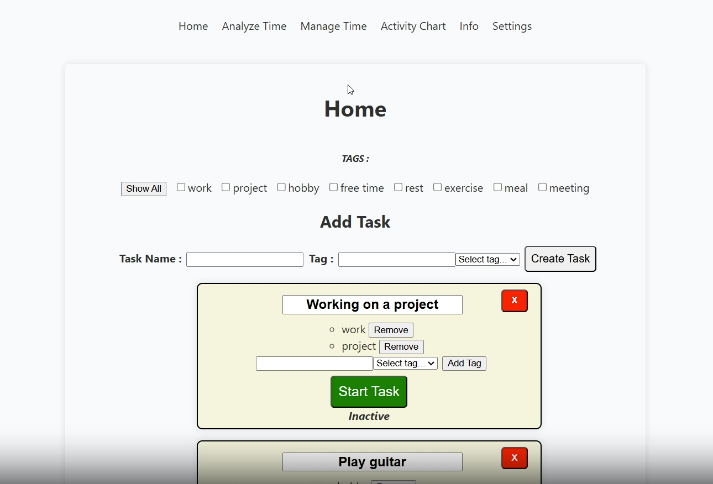

# Time Tracking Application

This application is designed to help users track time spent on different activities. Users can create tasks, assign tags, manage time intervals, and view detailed analyses of their time usage. The project is developed as part of the 5G00DM05-3005 Full Stack Web Development course.



## Table of Contents

- [Getting Started](#getting-started)
  - [Prerequisites](#prerequisites)
  - [Installing](#installing)
- [Usage](#usage)
- [Features](#features)
- [Built With](#built-with)
- [Contributing](#contributing)
- [License](#license)
- [Screenshots](#screenshots)

## Getting Started

These instructions will guide you to set up the project on your local machine for development and testing purposes.

### Prerequisites

- Node.js (v18.17.1 or higher)
- npm (v9.6.7 or higher)

### Installing

1. Clone the repository:
   ```sh
   git clone [repository URL]
   ```

2. Navigate to the project directory:
   ```sh
   cd [project-directory]
   ```

3. Install dependencies:
   ```sh
   npm install
   ```

4. Start the development server:
   ```sh
   npm start
   ```

5. Optionally, run the JSON server for the backend:
   ```sh
   npm run json-server
   ```

6. Open http://localhost:3000 in your browser.

## Usage

Once the application is running, you can start by creating tasks, adding tags, and tracking your time. Use the navigation menu to access different features like analyzing time, managing intervals, and viewing activity charts.

## Features

- Task creation with customizable tags
- Time tracking for each task with start and stop functionality
- Analyze time spent on tasks within a specified interval
- View a daily activity chart for selected tasks
- Manage time intervals for tasks
- Responsive UI supporting various screen resolutions
- Light and dark theme options
- Single task mode where activating a task deactivates others

## Built With

- React - The web framework used
- Vite - Build tool
- json-server - Used for backend simulation